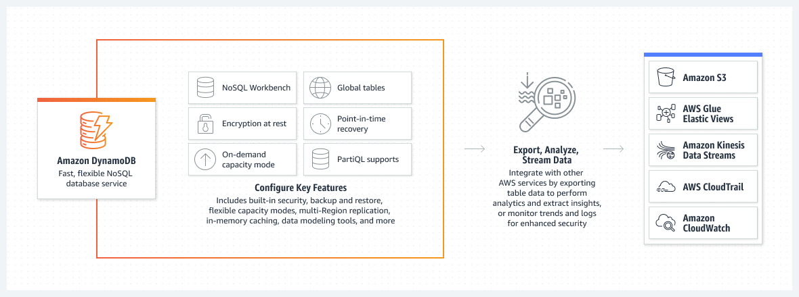
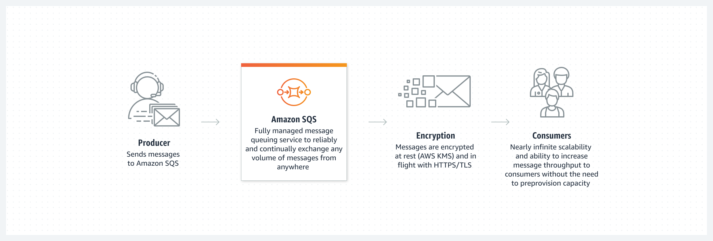

## 서버리스(Serverless)

- 최초 작성 일자: 2023-04-02
- 수정 내역:
    - 2023-04-02: 최초 작성

---

### AWS Lambda

- **서버에 대한 걱정 없이 코드 실행**
- 서버 또는 클러스터에 대한 걱정 없이 코드 실행

#### 사용 이유

- 인프라를 프로비저닝하거나 관리하지 않고 코드를 실행한다. zip 파일 또는 컨테이너 이미지로 코드를 작성하고 업로드하면 된다.
- 하루에 수십 개의 이벤트에서 초당 수십만 개에 이르기까지 어떤 규모에서든 코드 실행 요청에 자동으로 응답한다.
- 피크 용량에 대해 사전에 인프라를 프로비저닝하는 대신, 밀리초 기준으로 사용하는 컴퓨팅 시간에 대해서만 요금을 지불하여 비용을 절감한다.
- 올바른 함수 메모리 크기로 코드 실행 시간 및 성능을 최적화한다. 프로비저닝된 동시성으로 두자리수 밀리초 단위에서 높은 수요에 응답한다.

#### 작동 방식

- AWS Lambda는 서버를 프로비저닝 또는 관리하지 않고도 실제로 모든 유형의 애플리케이션 또는 백엔드 서비스에 대한 코드를 실행할 수 있는 이벤트 중심의 서버리스 컴퓨팅 서비스다.
- 200개가 넘는 AWS 서비스와 서비스형 소프트웨어(SaaS) 애플리케이션에서 Lambda를 트리거할 수 있으면 사용한 만큼만 지불하면 된다.

- **파일 처리**

- **스트림 처리**

- **웹 애플리케이션**

- **IoT 백엔드**

- **모바일 백엔드**

#### 사용 사례

- **대규모 데이터 처리**: 필요하면 필요한 용량으로 코드를 실행한다. 자동으로 데이터 볼륨과 일치하도록 크기를 조정하고 사용자 지정 이벤트 트리거를 지원한다.
- **대화영 웹 및 모바일 백엔드 실행**: AWS Lambda를 다른 AWS 서비스와 결합하여 안전하고 안정적이며 확장 가능한 온라인 경험을 생성한다.
- **강력한 기계 학습 인사이트 지원**: 기계 학습(ML) 모델에 제공하기 전에 데이터를 전처리한다. Amazon Elastic File System(EFS) 액세스와 함께 AWS Lambda는 크기 조정을 간소화하기 위해 인프라 관리 및 프로비저닝을 처리한다.
- **이벤트 중심의 애플리케이션 생성**: 분리된 서비스 사이에서 손쉬운 통신을 위해 이벤트 중심의 함수를 구축한다. 프키 수요 기간에 리소스 충돌이나 과도한 프로비저닝 없이도 애플리케이션을 실행하여 비용을 절감한다.

---

### Amazon API Gateway

- **API 구축, 배포 및 관리**
- 모든 규모의 API를 생성, 유지 관리 및 보호

- Amazon API Gateway는 어떤 규모에서든 개발자가 API를 손쉽게 생성, 게시, 유지 관리, 모니터링 및 보안 유지할 수 있도록 하는 완전관리형 서비스다.
- API는 애플리케이션이 백엔드 서비스의 데이터, 비즈니스 로직 또는 기능에 액세스할 수 있는 "정문" 역할을 한다.
- API Gateway를 사용하면 실시간 양방향 통신 애플리케이션이 가능하도록 하는 RESTful API 및 WebSocket API를 작성할 수 있다.
- API Gateway는 트래픽 관리, CORS 지원, 권한 부여 및 액세스 제어, 제한, 모니터링 및 API 버전 관리 등 최대 수십만 개의 동시 API 호출을 수신 및 처리하는 데 관계된 모든 작업을 처리한다.

#### 사용 이유

- **효율적인 API 개발**: API Gateway를 사용하여 동일한 API의 여러 버전을 동시에 실행하면 새로운 버전을 빠르게 반복, 테스트 및 릴리즈할 수 있다.
- **어떤 규모에서도 뛰어난 성능**: Amazon CloudFront를 사용하는 엣지 로케이션의 글로벌 네트워크를 활용하여 최종 사용자에게 API 요청 및 응답에 대해 가장 짧은 지연 시간을 제공한다.
- **규모에 따른 비용 절감**: API Gateway는 API 요청에 대해 계층화된 요금 모델을 제공한다.
- **간편한 모니터링**: Amazon CloudWatch를 사용하여 서비스에 대한 호출을 시작적으로 모니터링할 수 있는 API 게이트웨이 대시보드에서 성능 지표와 API 호출, 데이터 지연 시간 및 오류 발생률에 대한 정보를 모니터링한다.
- **유연한 보안 제어**: AWS IAM과 Amazon Cognito를 사용하여 API에 대한 액세스 권한을 부여한다. OAuth 토큰을 사용하는 경우 API Gateway가 기본 OIDC 및 OAuth2 지원을 제공한다.
- **RESTful API 옵션**: HTTP API 또는 REST API를 사용하여 RESTful API를 생성한다. HTTP API는 다수의 사용 사례에 대해 API를 구축하는 가장 좋은 방법이다.

#### 종류

##### RESTful API

- HTTP API를 사용하여 서버리스 워크로드 및 HTTP 백엔드에 최적화된 RESTful API를 구축한다.
- HTTP API는 API 프록시 기능만 필요한 API를 구축할 때 가장 적합하다.

##### WEBSOCKET API

- WebSocket API를 사용하여 채팅 앱 및 스트리밍 대시보드와 같은 실시간 양방향 통신 애플리케이션을 구축한다.
- API Gatewway는 백엔드 서비스와 클라이언트 간의 메시지 전송을 처리하기 위해 지속적인 연결을 유지한다.

#### 작동 방식

---

### Amazon DynamoDB

- **관리형 NoSQL 데이터베이스**
- 모든 규모에서 10밀리초 미만의 성능을 제공하는 빠르고 유연한 NoSQL 데이터베이스 서비스

#### 사용 이유

- 일관된 10밀리초 미만의 성능, 거의 무제한의 처리량 및 스토리지와 자동 다중 리전 복제 기능을 사용하여 앱을 제공할 수 있다.
- 유휴 시 암호화, 자동 백업 및 복원과 최대 99.999% 가용성의 SLA로 보장되는 안정성을 바탕으로 데이터를 보호한다.
- 요구 사항에 따라 자동으로 확장되고 축소되는 완전관리형 서버리스 데이터베이스를 통해 혁신에 집중하고 비용을 최적화할 수 있다.
- AWS 서비스와 통합하면 데이터로 더 많은 것을 수행할 수 있다. 기본 제공되는 도구를 사용하여 분석을 수행하고 인사이트를 추출하며 트래픽 추세를 모니터링할 수 있다.

#### 작동 방식

- Amazon DynamoDB는 모든 규모에서 고성능 애플리케이션을 실행하도록 설계된 완전관리형의 서버리스 Key-Value NoSQL 데이터베이스다.
- DynamoDB는 기본 제공 보안, 지속적인 백업, 자동화된 다중 리전 복제, 인 메모리 캐시 및 데이터 가져오기/내보내기 도구를 제공한다.
  

#### 사용 사례

- **소프트웨어 애플리케이션 개발**: 수백만 사용자와 초당 수백만 건의 요청에 대한 높은 동시성 및 연결이 요구되는 사용자 콘텐츠 메타데이터 및 캐시를 지원하는 인터넷 규모의 애플리케이션을 구축할 수 있다.
- **미디어 메타데이터 스토어 생성**: 실시간 동영상 스트리밍 및 대화형 컨텐츠와 같은 미디어 및 엔터테인먼트 워크로드의 처리량 및 동시성을 확장하고 AWS 리전에 걸친 다중 리전 복제를 짧은 대기 시간으로 제공할 수 있다.
- **원활한 소매 경험 제공**: 장바구니, 워크플로 엔진, 재고 추적 및 고객 프로필 배포를 위한 설계 패턴을 사용할 수 있다. DynamoDB는 높은 트래픽의 대규모 이벤트를 지원하며 초당 수백만 건의 쿼리를 처리할 수 있다.
- **게임 플랫폼 확장**: 운영 오버헤드 없이 혁신을 추진하는 데 집중할 수 있다. 수백만 동시 사용자의 플레이어 데이터, 세션 기록 및 순위표를 사용하여 게임 플랫폼을 구축할 수 있다.

---

### Amazon EventBridge

- **SaaS 앱 및 AWS 서비스를 위한 서버리스 이벤트 버스**
- AWS, 기존 시스템 또는 SaaS 애플리케이션에서 대규모 이벤트 기반 애플리케이션 구축

#### 사용 이유

- 느슨하게 결합된 이벤트 기반 아키텍처를 손쉽게 구축하여 새로운 기능을 더 빠르게 배포할 수 있다.
- 사용자 지정 코드를 작성하거나 서버를 관리하고 프로비저닝할 필요 없이 이벤트 생산자와 소비자 간의 지점 간 통합을 생성할 수 있다.
- AWS 서비스, 서비스형 소프트웨어(SaaS) 애플리케이션 및 사용자 지정 애플리케이션을 이벤트 생산자로 연결하여 워크플로를 시작할 수 있다.
- Amazon EventBridge 스케줄러를 사용하면 단일 소스에서 수백만 개의 이벤트와 태스크를 생성, 트리거 및 관리할 수 있다.

#### 작동 방식

- **Amazon EventBridge EventBus:** 이벤트 수신, 필터링, 변환, 라우팅 및 전송에 도움이 되는 서버리스 이벤트 버스.

- **Amazon EventBridge Pipes:** 선택적 필터링, 보강 및 변환 기능을 사용하여 이벤트 생산자와 이벤트 소비자를 연결하는 데 도움이 되는 서버리스 지점 간 통합 리소스다.

- **Amazon EventBridge Scheduler:** 태스크 및 이벤트를 대규모로 예약할 수 있다.

#### 사용 사례

- **개발자 민첩성 개선:** AWS, SaaS 앱 또는 자체 사용자 지정 앱을 사용하는 마이크로서비스가 분리되어 있는 여러 서비스 팀 간에 조정이 필요하지 않다.
- **애플리케이션 모니터링 및 감사:** AWS 환경을 모니터링 및 감사하고 애플리케이션의 운영 변경에 실시간으로 대응하여 인프라 취약성을 방지한다.
- **SaaS 통합을 통한 기능 확장:** 사용자 지정 이벤트를 EventBridge로 전송한 다음 API 대상을 통해 Zendesk CRM으로 전송하여 애플리케이션을 다른 SaaS 애플리케이션에 연결한다.
- **애플리케이션에서 일정 예약:** 애플리케이션 및 플랫폼에서 EventBridge Scheduler를 사용하여 미리 알림, 지연된 작업 또는 중지 위치에서 다시 시작 알림이 포함된 일정 예약 서비스를 제공한다.

---

### Amazon SNS

- **pub/sub, SMS, 이메일 및 모바일 푸시 알림**
- A2A 및 A2P 메시징을 위한 완전관리형 게시/구독 서비스

#### 사용 이유

- A2A(application-to-application) 알림을 제공하여 분산 애플리케이션을 통합하고 분리할 수 있다.
- SMS 문자, 푸시 알림, 이메일을 통해 고객에게 A2P(application-to-person) 알림을 배포할 수 있다.
- 메시지 필터링, 배치 처리, 정렬, 중복 제거를 통해 아키텍처를 간소화하고 비용을 절감할 수 있다.
- 보관, 전송 재시도 및 DLQ(Dead Letter Queue)를 통해 메시지 내구성을 향상시킬 수 있다.

#### 작동 방식

- Amazon SNS는 A2A와 A2P 두 가지 방식으로 알림을 전송한다.
- A2A는 분산된 시스템, 마이크로서비스 및 이벤트 중심의 서버리스 애플리케이션 간에 처리량이 많은 푸시 기반의 다대다 메시징을 제공한다.
- 애플리케이션은 Amazon SQS, Amazon Kinesis Data Firehose, AWS Lambda 기타 HTTPS 엔드포인트가 포함된다.
- A2P 기능을 사용하면 SMS 텍스트, 푸시 알림, 이메일을 통해 고객에게 메시지를 전송할 수 있다.
- Pub/Sub

- SMS

- Mobile Push

#### 사용 사례

- **애플리케이션을 FIFO 메시징과 통합:** 엄격하게 정렬된 선입 선출(FIFO) 방식으로 메시지를 전달하여 독립 애플리케이션에서 정확성과 일관성을 유지한다.
- **알림 메시지 전달을 안전하게 암호화:** AWS KMS(Key Management Service)로 메시지를 암호화하고, AWS PrivateLink로 트래픽 개인 정보 보호를 보장하고, 리소스 정책 및 태그로 액세스를 제어한다.
- **60개가 넘는 AWS 서비스에서 이벤트 캡처 및 팬아웃:** 분석, 컴퓨팅, 컨테이너, 데이터베이스, IoT, ML, 보안, 스토리지와 같은 AWS 카테고리 전반에 걸쳐 이벤트를 팬아웃한다.
- **240개국 이상의 고객에게 SMS 문자 전송:** 공급자 간에 중복성이 있는 전 세계 SMS를 사용한다. 발신자 ID, 긴 코드, 짧은 코드, TFN, 10DLC로 SMS 발신 ID를 설정한다.

---

### Amazon SQS

- **관리형 메시지 대기열**
- 마이크로서비스, 분산 시스템 및 서버리스 애플리케이션을 위한 완전관리형 메시지 대기열

#### 사용 이유

- 초기 비용 없이 소프트웨어를 관리하거나 인프라를 유지하지 않고 오버헤드를 제거할 수 있다.
- 메시지를 누락하거나 다른 서비스를 가용 상태로 유지하지 않고도 처리량에 관계 없이 대량의 데이터를 안정적으로 전송할 수 있다.
- 민감한 데이터를 애플리케이션 간에 안전하게 전송하고 AWS KMS를 사용하여 키를 중앙 집중식으로 관리할 수 있다.
- 사용량에 따라 탄력적이고 비용 효율적으로 확장할 수 있으므로 용량 계획 및 사전 프로비저닝에 대해 걱정할 필요가 없다.

#### 작동 방식

- AmazonSQS를 사용하면 메시지 손실을 우려하거나 다른 서비스를 제공할 필요 없이 소프트웨어 구성 요소 간에 어떤 볼륨의 메시지든 전송, 저장 및 수신할 수 있다.

#### 사용 사례

- **애플리케이션 신뢰성 및 확장성 향상:** Amazon SQS는 고객이 대기열을 사용하여 구성 요소(마이크로서비스)를 분리하고 연결할 수 있는 간단하고 안정적인 방법을 제공한다.
- **마이크로서비스 분리 및 이벤트 기반 애플리케이션 처리:** 뱅킹 애플리케이션에서와 같이 프론트엔드를 백엔드 시스템과 분리한다. 고객은 즉시 응답을 받지만 청구서 결제는 백그라운드에서 처리된다.
- **작업을 비용 효율적이고 정시에 완료하도록 보장:** 자동 크기 조정 그룹의 여러 작업자가 워크로드 및 지연 시간 요구 사항에 따라 확장 및 축소되는 단일 대기열에 작업을 배치한다.
- **메시지 순서 유지 및 중복 제거:** 메시지 순서를 유지하면서 대규모로 메시지를 처리하여 메시지 중복을 제거할 수 있다.

---

### Amazon S3

- **클라우드에서의 확장 가능한 스토리지**
- 어디서나 원하는 양의 데이터를 검색할 수 있도록 구축된 객체 스토리지

#### 사용 이유

- 99.99999999999%(9가 11개)의 데이터 내구성으로 스토리지 리소스 크기를 조정하여 변화가 잦은 요구 사항을 충족한다.
- Amazon S3 스토리지 클래스 전체에 데이터를 저장하여 선불 투자 또는 하드웨어 교체 주기 없이 비용을 절감한다.
- 비교 불가능한 보안, 규정 준수 및 감사 기능을 통해 데이터를 보호한다.
- 강력한 액세스 제어, 유연한 복제 도구 및 조직 전체 가시성을 통해 모든 규모에서 데이터를 손쉽게 관리한다.

#### 작동 방식

- Amazon S3는 업계 최고 수준의 확장성, 데이터 가용성, 보안 및 성능을 제공하는 객체 스토리지 서비스다.
- 고객은 규모와 업종에 관계없이 원하는 양의 데이터를 저장하고 보호하여 데이터 레이크, 클라우드 네이티브 애플리케이션 및 모바일 앱과 같은 거의 모든 사용 사례를 지원할 수 있다.
- 비용 효율적인 스토리지 클래스와 사용이 쉬운 관리 기능을 통해 비용을 최적화하고, 데이터를 정리하고, 세분화된 액세스 제어를 구성하여 특정 비즈니스, 조직 및 규정 준수 요구 사항을 충족할 수 있다.

#### 사용 사례

- **데이터 레이크 구축**: 모든 클라우드 데이터에서 빅 데이터 분석, 인공 지능(AI), 기계 학습(ML), 고성능 컴퓨팅(HPC) 애플리케이션을 실행하여 데이터 인사이트를 확보할 수 있다.
- **중요한 데이터의 백업 및 복원**: S3의 강력한 복제 기능을 통해 복구 목표 시간(RTO), 복구 목표 시점(RPO) 및 규정 준수 요건을 충족할 수 있다.
- **최저 비용으로 데이터 아카이브**: 데이터 아카이브를 Amazon S3 Glacier 스토리지 클래스로 이동하면 비용을 절감하고 운영 복잡성을 제거하며 새로운 인사이트를 얻을 수 있다.
- **클라우드 네이티브 애플리케이션 실행**: 고가용성 구성에서 자동으로 크기 조정되는 빠르고 강력한 모바일 및 웹 기반 클라우드 네이티브 앱을 구축할 수 있다.

---

### AWS Application Composer

- **시각적으로 디자인하고 신속하게 서버리스 애플리케이션 구축**

#### 사용 이유

- 추측을 거의 배제하면서, AWS 서비스를 사용하여 시각적으로 서버리스 애플리케이션을 만든다.
- 즉시 배포할 수 있고 모범 사례에 부합하는 코드형 인프라(IaC)를 빠르게 생성한다.
- 간편하게 팀원 간에 공유하고 구축하면서 아키텍처 모델을 유지 관리한다.

#### 작동 방식

- AWS Application Composer는 서버리스 애플리케이션의 아키텍처링, 구성, 구축을 간소화하고 빠르게 진행하도록 도와준다.

#### 사용 사례

- **새로운 서버리스 애플리케이션 설계 및 구축**: 여러 AWS 서비스에서 서버리스 애플리케이션의 구성을 간소화한다.
- **IaC를 통한 애플리케이션 관리**: 아키텍처에 포함된 각 서비스의 즉시 배포 가능한 구성 및 IaC를 생성하는 등의 일반적인 작업을 간소화한다.
- **애플리케이션 아키텍처 및 구성 시각화**: 고객의 팀과 협업하면서 애플리케이션 아키텍처 및 구성 요소를 빠르게 파악한다.

---

### AWS AppSync

- **확장 가능한 완전관리형 GraphQL API**
- 서버리스 GraphQL과 Pub/Sub API로 애플리케이션 개발을 가속화

#### 사용 이유

- 한 번의 네크워크 요청을 통해 하나 이상의 소스 또는 마이크로서비스의 데이터에 액세스할 수 있다.
- 서버리스 WebSocket을 통해 이벤트 소스의 데이터를 구독 클라이언트에 게시하여 매력적인 실시간 환경을 만들 수 있다.
- 오프라인 데이터 동기화, 버저닝, 충돌 해결을 통해 오프라인에서도 데이터와 상호 작용하고 데이터를 업데이트할 수 있다.
- API 요청에 대한 요금 및 연결된 클라이언트로 전송되는 실시간 메시지에 대한 요금만 지불하면 된다.

#### 작동 방식

- AWS AppSync는 단일 엔드포인트를 통해 애플리케이션 개발을 간소화하는 서버리스 GraphQL 및 Pub/Sub API를 생성하여 데이터를 안전하게 쿼리, 업데이트 또는 게시한다.

- **GraphQL API**: AWS AppSync로 구축된 GraphQL API를 통해 프론트엔드 개발자는 단일 GraphQL 엔드포인트에서 여러 데이터베이스, 마이크로서비스 및 API를 쿼리할 수 있다.

- **Pub/Sub API**: 프론트엔드 개발자는 AWS AppSync로 구축된 Pub/Sub API를 사용하여 서버리스 WebSockets 연결을 통해 실시간 데이터 업데이트를 구독 API 클라이언트에 게시할 수 있다.

#### 사용 사례

- **여러 데이터 소스에서 데이터 검색 또는 수정**: 단일 네트워크 호출로 여러 데이터 소스(SQL, NoSQL, 검색 데이터, REST 엔드포인트 및 마이크로서비스)와 상호 작용한다.
- **클라이언트가 중단된 경우 데이터 동기화**: AWS AppSync 및 AWS Amplify DataStore를 사용하여 모바일 및 웹 애플리케이션과 클라우드 간에 데이터를 자동으로 동기화한다.
- **실시간 협업 및 채팅 애플리케이션 구축**: 백엔드에서 연결된 클라이언트 간 데이터를 브로드캐스트하고 대화형 모바일 또는 웹 애플리케이션을 구축한다.
- **IoT 데이터 관리**: AWS IoT 서비스로 전송된 디바이스 데이터에 액세스하여 모바일 또는 웹 애플리케이션에서 실시간 대시보드를 구축한다.

---

### AWS Fargate

- **컨테이너용 서버리스 컴퓨팅**
- 컨테이너에 적합한 서버리스 컴퓨팅

#### 사용 이유

- 인프라가 아닌 애플리케이션 배포 및 관리 Fargate는 서버 크기 조정, 패치, 보안 및 관리의 운영 부담을 없애준다.
- Amazon CloudWatch Container Insights와 같은 AWS 서비스와의 기본 제공 통합을 통해 애플리케이션을 모니터링한다. 서드 파티 도구로 지표 및 로그를 수집한다.
- 설계에 따라 워크로드 격리를 통해 보안을 개선한다. Amazon ECS 태스크 및 Amazon EKS 파드는 전용 런타임 환경에서 실행된다.
- 요금은 사용한 만큼만 지불하면 된다. Fargate는 지정된 리소스 요구 사항에 가장 근접하도록 컴퓨팅 크기를 조정한다. Fargate를 사용하면 추가 서버를 사용하기 위해 과도하게 프로비저닝하거나 관련 비용을 지불하지 않아도 된다.

#### 작동 방식

- AWS Fargate는 서버를 관리하지 않고도 애플리케이션 구축에 초점을 맞출 수 있도록 지원하는 종량제 서버리스 컴퓨팅 엔진이며, Amazon ECS, Amazon EKS와 호환된다.
  

#### 사용 사례

- **웹 앱, API 및 마이크로서비스**: 컨테이너의 속도 및 불변성을 바탕으로 애플리케이션, API 및 마이크로서비스 아키텍처를 구축 및 배포한다. Fargate는 가장 중요한 애플리케이션에 초점을 맞출 수 있도록 컴퓨팅 인프라의 수명 주기를 소유, 실행 및 관리할 필요성을 없애준다.
- **컨테이너 워크로드 실행 및 크기 조정**: Amazon ECS 또는 Amazon EKS와 함께 Fargate를 사용하여 컨테이너식 데이터 처리 워크로드를 손쉽게 실행 및 크기 조정한다. 또한 Fargate를 사용하면 레거시 애플리케이션을 리팩토링하거나 리아키텍팅하지 않고 Amazon ECS Windows 컨테이너를 마이그레이션하고 실행할 수 있다.
- **AI 및 기계 학습 훈련 애플리케이션 지원**: 유연하고 이식 가능한 AI 및 기계 학습 개발 환경을 구축한다. Fargate를 통해 기계 학습(ML) 모델을 훈련, 테스트 및 배포 하기 위해 과도하게 프로비저닝하지 않고도 서버 용량을 증대하는 데 필요한 확장성을 달성한다.
- **비용 최적화**: AWS Fargate를 사용하면 선결제 비용이 없으며 사용한 리소스에 대해서만 비용을 지불한다. Compute Savings Plans 및 Fargate Spot으로 추가로 최적화한 다음 Graviton2 기반 Fargate를 사용하여 가격 대비 성능을 최대 40% 향상 시킬 수 있다.

---

### AWS Step Functions

- **분산 애플리케이션을 위한 조정**
- 분산 애플리케이션을 위한 시각적 워크플로

#### 사용 이유

- 복잡한 비즈니스 로직을 표현하기 위한 간단한 드래그 앤 드롭 인터페이스인 Workflow Studio를 사용하여 신속하게 구축할 수 있다.
- 코드를 유지 관리하지 않고 220개 넘는 AWS 서비스를 통해 워크플로를 자동화할 수 있다.
- 대규모 병렬 워크플로에서 코드를 사용하여 데이터를 온디맨드로 처리한다.
- 이벤트 기반 아키텍처를 위해 복원력 있는 워크플로를 시각화한다.

#### 작동 방식

- AWS Step Functions는 개발자가 AWS 서비스를 사용하여 분산 애플리케이션을 구축하고, 프로세스를 자동화하며, 마이크로서비스를 오케스트레이션하고, 데이터 및 기계 학습(ML) 파이프라인을 생성할 수 있도록 지원하는 시각적 워크플로 서비스다.

#### 사용 사례

- **추출, 변환, 적재(ETL) 프로세스 자동화:** 수동으로 오케스트레이션하지 않고 여러 개의 장기 실행 ETL 작업이 순서대로 실행되고 성공적으로 완료될 수 있도록 한다.
- **보안 및 IT 기능 자동화:** 보안 인시던트 대응을 위해 수동 도착 단계를 비롯한 자동화된 워크플로를 생성할 수 있다.
- **마이크로서비스 오케스트레이션:** 여러 AWS Lambda 함수를 응답성이 뛰어난 서버리스 애플리케이션 및 마이크로서비스로 결합할 수 있다.
- **대규모 병렬 워크플로 오케스트레이션:** 보안 로그, 트랜잭션 데이터 또는 이미지 및 동영상 파일과 같은 대규모 데이터 세트를 반복하고 처리할 수 있다.

---

### 참고한 자료

- [AWS Lambda](https://aws.amazon.com/ko/lambda/?nc2=h_ql_prod_serv_lbd)
- [Amazon API Gateway](https://aws.amazon.com/ko/api-gateway/?nc2=h_ql_prod_serv_apig)
- [Amazon DynamoDB](https://aws.amazon.com/ko/dynamodb/?nc2=h_ql_prod_serv_ddb)
- [Amazon EventBridge](https://aws.amazon.com/ko/eventbridge/?nc2=h_ql_prod_serv_eb)
- [Amazon SNS](https://aws.amazon.com/ko/sns/?nc2=h_ql_prod_serv_sns#)
- [Amazon SQS](https://aws.amazon.com/ko/sqs/?nc2=h_ql_prod_serv_sqs)
- [Amazon S3](https://aws.amazon.com/ko/s3/?nc2=h_ql_prod_serv_s3#)
- [AWS Application Composer](https://aws.amazon.com/ko/application-composer/?nc2=h_ql_prod_serv_ac)
- [AWS AppSync](https://aws.amazon.com/ko/appsync/?nc2=h_ql_prod_serv_apps)
- [AWS Fargate](https://aws.amazon.com/ko/fargate/?nc2=h_ql_prod_serv_far)
- [AWS Step Functions](https://aws.amazon.com/ko/step-functions/?nc2=h_ql_prod_serv_stf)