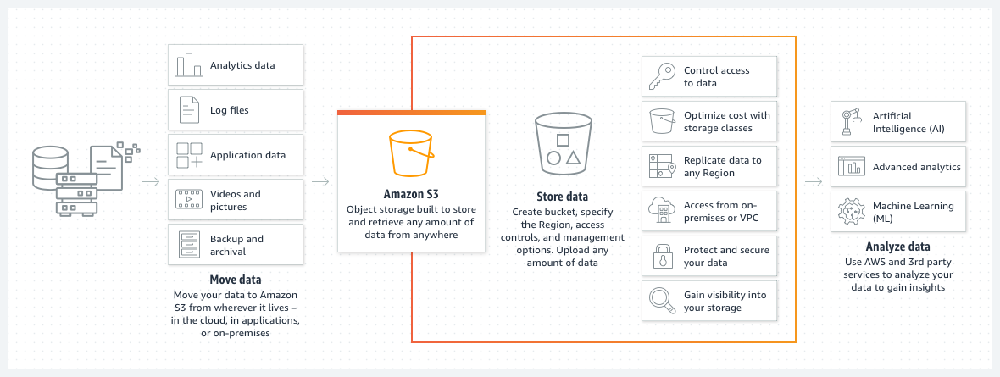

## 스토리지(Storage)

- 최초 작성 일자: 2023-04-02
- 수정 내역:
    - 2023-04-02: 최초 작성

---

### Amazon S3

- **클라우드에서의 확장 가능한 스토리지**
- 어디서나 원하는 양의 데이터를 검색할 수 있도록 구축된 객체 스토리지

#### 사용 이유

- 99.99999999999%(9가 11개)의 데이터 내구성으로 스토리지 리소스 크기를 조정하여 변화가 잦은 요구 사항을 충족한다.
- Amazon S3 스토리지 클래스 전체에 데이터를 저장하여 선불 투자 또는 하드웨어 교체 주기 없이 비용을 절감한다.
- 비교 불가능한 보안, 규정 준수 및 감사 기능을 통해 데이터를 보호한다.
- 강력한 액세스 제어, 유연한 복제 도구 및 조직 전체 가시성을 통해 모든 규모에서 데이터를 손쉽게 관리한다.

#### 작동 방식

- Amazon S3는 업계 최고 수준의 확장성, 데이터 가용성, 보안 및 성능을 제공하는 객체 스토리지 서비스다.
- 고객은 규모와 업종에 관계없이 원하는 양의 데이터를 저장하고 보호하여 데이터 레이크, 클라우드 네이티브 애플리케이션 및 모바일 앱과 같은 거의 모든 사용 사례를 지원할 수 있다.
- 비용 효율적인 스토리지 클래스와 사용이 쉬운 관리 기능을 통해 비용을 최적화하고, 데이터를 정리하고, 세분화된 액세스 제어를 구성하여 특정 비즈니스, 조직 및 규정 준수 요구 사항을 충족할 수 있다.

#### 사용 사례

- **데이터 레이크 구축**: 모든 클라우드 데이터에서 빅 데이터 분석, 인공 지능(AI), 기계 학습(ML), 고성능 컴퓨팅(HPC) 애플리케이션을 실행하여 데이터 인사이트를 확보할 수 있다.
- **중요한 데이터의 백업 및 복원**: S3의 강력한 복제 기능을 통해 복구 목표 시간(RTO), 복구 목표 시점(RPO) 및 규정 준수 요건을 충족할 수 있다.
- **최저 비용으로 데이터 아카이브**: 데이터 아카이브를 Amazon S3 Glacier 스토리지 클래스로 이동하면 비용을 절감하고 운영 복잡성을 제거하며 새로운 인사이트를 얻을 수 있다.
- **클라우드 네이티브 애플리케이션 실행**: 고가용성 구성에서 자동으로 크기 조정되는 빠르고 강력한 모바일 및 웹 기반 클라우드 네이티브 앱을 구축할 수 있다.

---

### Amazon S3 Glacier 스토리지 클래스

- **클라우드상의 저렴한 아카이브 스토리지**
- 최저 비용과 밀리초 단위의 액세스로 데이터를 보관할 수 있는 안전하며 내구성 있는 장기 스토리지 클래스
- Amazon S3 Glacier 스토리지 클래스는 데이터 아카이빙을 위해 특별히 제작되어 클라우드에서 최고의 성능, 최고의 검색 유연성, 최저 비용의 아카이브 스토리지를 제공한다.
- 모든 S3 Glacier 스토리지 클래스는 사실상 무제한 확장성을 제공하며 99.99999999999%(9가 11개)의 데이터 내구성을 제공하도록 설계되었다.
- S3 Glacier 스토리지 클래스는 아카이브 데이터에 가장 빠르게 액세스할 수 있는 옵션과 클라우드에서 가장 저렴한 아카이브 스토리지를 제공한다.

#### 사용 이유

- **밀리초 단위의 빠른 검색**: Amazon S3 Glacier 스토리지 클래스는 성능 요구 사항에 맞게 밀리초에서 몇 시간까지 검색 옵션을 제공한다.
- **따라올 수 없는 내구성 및 확장성**: Amazon S3 Glacier 스토리지 클래스는 사실상 무제한 확장성을 갖춘 세계 최대의 글로벌 클라우드 인프라에서 실행되어 높은 내구성을 제공하도록 설계되었다.
- **가장 포괄적인 보안 및 규정 준수 기능**: S3 Glacier 스토리지 클래스는 AWS CloudTrail과 정교하게 통합되어 감사를 위해 스토리지 API 호출 활동을 기록, 모니터링 및 보존하고 세 가지 서로 다른 암호화 형태를 지원한다.
  이러한 스토리지 클래스는 SEC Rule 17a-4, PCI-DSS, HIPAA/HITECH, FedRAMP, EUGDPR 및 FISMA를 비롯한 보안 표준 및 규정 준수 인증을 지원한다.
- **최저 비용**: 모든 S3 Glacier 스토리지 클래스는 특정 액세스 패턴에 대해 가장 저렴한 스토리지로 설계되어 매우 저렴한 비용으로 많은 양의 데이터를 보관할 수 있다.
  따라서 데이터 레이크, 분석, 사물 인터넷(IoT), 기계 학습, 규정 준수 및 미디어 자산 아카이빙과 같은 사용 사례에 맞춰 모든 데이터를 유지할 수 있다.
- **가장 많은 파트너, 공급 업체 및 AWS 서비스에서 지원**: 대부분의 AWS 서비스와 통합되는 것 외에도, Amazon S3 객체 스토리지 서비스에는 수만 개에 달하는 컨설팅, 시스템 통합 사업자 및 Independent Software Vendor(ISV) 파트너가 포함되어 있으며 매달 더 많은 파트너가 가입하고 있다.
- **데이터 수명 주기 전반에 걸친 일관성**: 모든 S3 Glacier 스토리지 클래스는 모든 AWS 리전에서 사용할 수 있으며, 표준 S3 API를 사용하며 스토리지 사용량 및 활동 지표를 보기 위한 S3 Storage Lens, 객체 데이터에 대한 서버 측 암호화, 실수로 삭제되는 것을 방지하기 위한 S3 Object Lock, VPC의 프라이빗 엔드포인트를 통해 S3에 액세스하기 위한 AWS PrivateLink 등의 모든 S3 기능을 지원한다.

#### 작동 방식

- **개요**: Amazon S3 Glacier 스토리지 클래스는 데이터 아카이빙을 위해 특별히 제작되어 클라우드에서 최고의 성능, 최고의 검색 유연성, 최저 비용의 아카이브 스토리지를 제공한다.
  다양한 액세스 패턴과 스토리지 기간에 최적화된 세 가지 아카이브 스토리지 클래스 중에서 선택할 수 있다.

- **Amazon S3 Glacier Instant Retrieval 스토리지 클래스**: S3 Glacier Instant Retrieval은 분기당 한 번 액세스되고 밀리초 단위의 검색이 필요한 수명이 긴 데이터에 대해 S3 Standard-Infrequent Access보다 최대 68% 더 저렴한 비용으로 가장 저렴한 스토리지를 제공한다.
  자주 액세스하지 않지만 이미지 호스팅, 온라인 파일 공유 애플리케이션, 의료 영상 및 건강 기록, 뉴스 미디어 자산, 위성 및 항공 영상과 같이 성능에 민감한 사용 사례에서 즉시 액세스할 수 있어야 하는 데이터용으로 설계되었다.
  S3 Glacier Instant Retrieval은 저렴한 GB당 스토리지 요금과 약간 더 높은 GB당 검색 요금으로 S3 Standard-IA와 유사한 뛰어난 내구성, 높은 처리량 및 짧은 대기 시간을 제공한다.

- **Amazon S3 Glacier Flexible Retrieval 스토리지 클래스**: S3 Glacier Flexible Retrieval은 연간 1~2회 액세스하고 비동기식으로 검색되는 아카이브 데이터에 대해 S3 Glacier Instant Retrieval보다 최대 10% 더 저렴한 비용으로 스토리지를 제공한다.
  S3 Glacier Flexible Retrieval은 즉각적인 액세스가 필요하지 않지만 백업 또는 재해 복구 사용 사례와 같이 대규모 데이터 집합을 무료로 검색할 수 있는 유연성이 필요한 아카이브 데이터에 이상적인 스토리지 클래스다.
  S3 Glacier Flexible Retrieval은 몇 분 정도에서 몇 시간까지 다양한 액세스 시간에서 비용의 균형을 조정하는 가장 유연한 검색 옵션과 무료 대량 검색 기능을 제공한다.
  가끔 몇 분 안에 일부 데이터를 검색해야 하고 비용에 대해 걱정하고 싶지 않은 경우, 그리고 백업, 재해 복구, 오프상리트 데이터 스토리지 요구 사항에 대해 적합한 솔루션이다.

- **Amazon S3 Glacier Deep Archive 스토리지 클래스**: S3 Glacier Deep Archive는 최저 비용의 스토리지를 제공한다.
  연 1회 미만으로 액세스되고 비동기식으로 검색되는 수명이 긴 아카이브 데이터의 경우 S3 Glacier Flexible Retrieval 대비 최대 75%까지 비용을 낮출 수 있다.
  S3 Glacier Deep Archive는 매월 GB당 0.00099 USD(TB당 약 1 USD)로 클라우드에서 가장 저렴한 스토리지를 제공한다. 
  온프레미스 테이프에서 데이터를 저장 및 유지 관리하거나 오프사이트에서 데이터를 보관하는 것보다 훨씬 낮은 가격으로 이용할 수 있으므로, 비용 효율적이고 관리하기 쉬운 테이프의 대안이다.
  고객 요구 사항과 규정 준수 요구 사항을 충족하기 위해 데이터 집합을 7 ~ 10년 이상 보관하는 금융 서비스, 의료, 미디어, 엔터테인먼트, 공공 부문의 고객을 위해 설계되었다.

#### 사용 사례

- **미디어 자산 워크플로**: Amazon S3 Glacier Instant Retrieval 스토리지 클래스를 사용하면 이전 미디어 콘텐츠를 저렴하게 보관하면서 필요할 때 밀리초 단위로 계속 사용할 수 있다.
- **의료 정보 아카이빙**: Amazon S3 Glacier 및 S3 Glacier Deep Archive 스토리지 클래스를 사용하면 매우 저렴한 비용으로 환자 레코드 데이터를 안전하게 아카이빙할 수 있다.
- **규정, 규정 준수 및 비즈니스 정책 아카이빙**: 금융 서비스 및 의료 서비스와 같은 많은 기업에서는 규제 및 규정 준수를 위해 아카이브를 장기간 보관해야 한다.
  Amazon S3의 객체 잠금 기능을 사용하면 SEC 규칙 17a~4(f)와 같은 목적에 맞게 규정 준수 제어 항목을 설정할 수 있다.
- **과학적 데이터 스토리지**: Amazon S3 Glacier Instant Retrieval 스토리지 클래스를 사용하면 가장 저렴한 스토리지 및 밀리초 단위의 검색을 통해 하드웨어 및 시설 관리자 용량 계획 등의 복잡한 작업을 피할 수 있다.
- **디지털 보존**: 어려운 데이터 검증 및 수동 복구 작업이 필요할 수 있는 일반적인 시스템과 달리, Amazon S3는 정기적이고 체계적인 데이터 무결성 점검을 수행하며 자동으로 자가 치유 기능을 실행하도록 설계되어 있다.
- **장기 백업 보존**: S3 Glacier 스토리지 클래스는 백업을 위한 가장 저렴한 아카이브 스토리지를 제공하는 동시에 필요할 때 데이터를 사용할 수 있도록 한다.
- **테이프 대체**: Amazon S3 Glacier 스토리지 클래스는 선결제 비용이 없고 유지 관리 비용과 부담이 없으며 온프레미스 테이프 아카이브보다 더 빠른 액세스를 제공한다.

---

### Amazon Elastic Block Storage(EBS)

- **EC2 블록 스토리지 볼륨**
- 사용하기 쉬운 대규모 고성능 블록 스토리지

#### 사용 이유

- SAP, Oracle 및 Microsoft 제품과 같은 미션 크리티컬 애플리케이션을 포함하여, 가장 까다로운 고성능 워크로드에 맞춰 빠르게 확장할 수 있다.
- 가용 영역(AZ) 내 복제를 포함한 99.999%의 가용성과 io2 Block Express 볼륨의 99.999% 내구성을 통해 장애로부터 보호할 수 있다.
- 워크로드에 가장 적합한 스토리지를 선택하여, GB당 요금이 경제적인 볼륨부터 가장 빠른 IOPS 및 처리량을 제공하는 고성능 볼륨 중에서 선택할 수 있다.

#### 작동 방식

- Amazon EBS는 사용이 쉽고 확장 가능한 고성능 블록 스토리지 서비스로서 Amazon EC2용으로 설계되었다.

#### 사용 사례

- **I/O 집약적 애플리케이션을 위해 클라우드에서 SAN 구축**: 클라우드로 중간 범위의 온프레미스 Storage Area Network(SAN) 워크로드를 마이그레이션한다.
  미션 크리티컬 애플리케이션을 위한 뛰어난 성능과 고가용성의 블록 스토리지를 연결한다.
- **관계형 데이터베이스 또는 NoSQL 데이터베이스 실행**: SAP HANA, Oracle, Microsoft SQL Server, PostgreSQL, MySQL, Cassandra 및 MongoDB 등 선택한 데이터베이스를 배포하고 확장할 수 있다.
- **적정 크기의 빅데이터 분석 엔진**: Hadoop 및 Spark와 같은 빅데이터 분석 엔진에 맞춰 클러스터 크기를 손쉽게 변경하고 볼륨을 자유롭게 분리한 후 다시 연결할 수 있다.

---

### Amazon Elastic File System(EFS)

- **EC2를 위한 완전관리형 파일 시스템**
- 서버리스 방식의 완전 탄력적인 파일 스토리지

#### 사용 이유

- AWS 컴퓨팅 시스템을 위한 공유 파일 시스템을 간편하고 빠르게 생성하고 구성한다. 프로비저닝, 배포, 패치 적용 또는 유지 관리가 필요하지 않다.
- 스토리지 및 성능이 완전 탄력적이므로 용량 계획이 필요하지 않다.
- 사용한 스토리지 요금만 지불하면 자주 액세스되지 않는 파일을 자동으로 이동하여 비용을 최대 92% 절감한다.
- 99.999999999%(9가 11개)의 내구성과 최대 99.99%(9가 4개)의 가용성을 제공하도록 설계되었고 완전관리형 파일 시스템을 통해 안전하고 안정적으로 파일에 액세스한다.

#### 작동 방식

- Amazon Elastic File System(EFS)은 파일을 추가하고 제거할 때 자동으로 확장되고 축소되며 관리 또는 프로비저닝이 필요하지 않다.

#### 사용 사례

- **DevOps 간소화**: 안전하고 체계적인 방식으로 코드 및 기타 파일을 공유하여 DevOps 민첩성을 높이고 고객 피드백에 더 빠르게 응답한다.
- **애플리케이션 개발 현대화**: AWS 컨테이너 및 서버리스 애플리케이션의 데이터를 유지하고 공유한다. 
- **콘텐츠 관리 시스템 개선**: 현대적 콘텐츠 관리 시스템(CMS) 워크로드를 위한 영구 스토리지를 간소화한다. 
  제품 및 서비스 출시를 앞당기고 저렴한 비용으로 더 안정적이고 안전하게 출시할 수 있다.
- **데이터 과학 가속화**: 사용 및 크기 조정이 쉬운 Amazon EFS는 기계 학습(ML) 및 빅데이터 분석 워크로드에 필요한 성능 및 일관성을 제공한다.

---

### Amazon FSx for Lustre

- **S3와 통합된 고성능 파일 시스템**
- 전 세계에서 널리 사용되는 고성능 파일 시스템에 구축된 완전관리형 공유 스토리지다.

#### 사용 이유

- 1밀리초 미만의 대기 시간, 최대 수백 GB/초의 처리량, 수백만 IOPS를 제공하는 공유 스토리지로 컴퓨팅 워크로드를 가속화할 수 있다.
- 사용자의 파일 시스템을 S3 버킷에 연결하여 고성능 파일 시스템에서 Amazon S3 데이터를 액세스하고 처리할 수 있다.
- 스토리지 유형, 성능 티어, 복제 수준 등 다양한 배포 옵션을 통해 가격 대비 성능을 최적화할 수 있다.
- 자동 데이터 압축 및 스토리지 할당량으로 스토리지 비용을 절감하고 모니터링할 수 있다.

#### 작동 방식

- Amazon FSx for Lustre는 널리 사용되는 Lustre 파일 시스템의 확장성과 성능을 가진 완전관리형 공유 스토리지를 제공한다.

#### 사용 사례

- **기계 학습(ML) 가속화**: 컴퓨팅 리소스에 대한 처리량 최대화 및 Amazon S3에 저장된 훈련 데이터에 대한 원활한 액세스를 통해 훈련 횟수를 줄인다.
- **고성능 컴퓨팅(HPC) 활성화**: AWS 컴퓨팅 및 오케스트레이션 서비스에 기본적으로 포함된 고속 고가용성 스토리지를 통해 가장 까다로운 HPC 워크로드의 처리를 돕는다.
- **빅데이터 분석 활용**: 페타바이트급 데이터에 대한 복잡한 분석 워크로드를 실행하는 수천 개의 컴퓨팅 인스턴스를 지원한다.
- **미디어 워크로드 민첩성 개선**: 컴퓨팅 상황에 따라 확장되고 스토리지를 사용하여 매우 짧은 시각 효과(VFX), 렌더링, 트랜스코딩 타임라인에 대처한다.

---

### Amazon FSx for NetApp ONTAP

- **널리 사용되는 NetApp의 ONTAP 파일 시스템에 구축된 완전관리형 공유 스토리지**

#### 사용 이유

- AWS에서 ONTAP의 데이터 액세스 및 데이터 관리 기능을 통해 애플리케이션을 더욱 빠르게 마이그레이션하고 구축할 수 있다.
- 업계 표준 NFS, SMB 및 iSCSI 프로토콜을 통해 다양한 워크로드 및 사용자에 데이터를 사용할 수 있다.
- 자동으로 확장 및 축소되는 스토리지 용량으로, 증가하는 데이터 집합을 지원한다.
- 내장된 스토리지 효율성 및 계층화 기술과 함께, 적은 비용으로 SSD 성능을 활용할 수 있다.

#### 작동 방식

- Amazon FSx for NetApp ONTAP은 ONTAP의 데이터 액세스 및 관리 기능을 제공하는 AWS 클라우드 기반의 인기 있는 완전관리형 공유 스토리지를 제공한다.

#### 사용 사례

- **AWS로 워크로드를 원활하게 마이그레이션**: 애플리케이션 코드나 데이터 관리 방법을 수정하지 않고 NetApp이나, 기타 NFS/SMB/iSCSI 서버에서 실행 중인 워크로드를 AWS로 이동한다.
- **현대적 애플리케이션 구축**: 고성능 스토리지 및 QoS 제어를 통해 사용자에게 빠르고 일관된 환경을 제공하고 크기에 관계없이 즉시 데이터 집합의 스냅샷을 생성하고 데이터 집합을 복제할 수 있다.
- **데이터 관리 현대화**: 사실상 무제한의 탄력적인 스토리지 용량으로 확장하고, 고급 보안 기능을 이용하여 랜섬웨어 및 기타 공격으로부터 보호한다.
- **비즈니스 연속성 간소화**: 온프레미스 파일 서버 또는 AWS 리전에서 단순하고 안전한 백업, 아카이브 및 복제 기능을 활용하여 데이터 보존 및 재해 복구를 개선한다.

---

### Amazon FSx for OpenZFS

- **널리 사용되는 OpenZFS 파일 시스템에 구축된 완전관리형 공유 스토리지**

#### 사용 이유

- 현재 사용하는 파일 스토리지와 동급 또는 그 이상의 기능을 지원하고 NFS 프로토콜을 통해 액세스할 수 있는 파일 스토리지를 통해 Linux 파일 서버를 AWS로 쉽게 마이그레이션할 수 있다.
- OpenZFS 인스턴스 데이터 스냅샷 및 데이터 복제를 사용하여 애플리케이션 구축 및 테스트를 간소화한다.
- 1백만이 넘는 IOPS를 몇백 밀리초의 지연 시간 내에 제공하는 고성능 스토리지로 워크로드를 가속화한다.
- 클릭 몇 번으로 스루풋 수준을 확장하고 데이터 압축과 같은 스토리지 효율성 기능을 활성화하여 비용을 최적화한다.

#### 작동 방식

- Amazon FSx for OpenZFS는 NFS 프로토콜(v3, v4, v4.1 및 v4.2)을 통해 액세스 가능한 OpenZFS 파일 시스템에 구축된 완전관리형 공유 파일 스토리지를 제공한다.

#### 사용 사례

- **AWS로 워크로드를 원활하게 마이그레이션**: 애플리케이션 코드나 데이터 관리 방법을 수정하지 않고 ZFS 또는 기타 Linux 기반 파일 서버에서 실행 중인 워크로드를 AWS로 이동한다.
- **데이터 분석 워크로드에 대한 인사이트를 빠르게 제공**: 기계 학습(ML), 금융 분석 및 기타 데이터 집약적 애플리케이션을 높은 IOPS의 스토리지로 강화한다.
- **콘텐츠 관리 가속화**: WordPress, Drupal, Magento를 포함해 파일 기반 웹 제공 및 콘텐츠 관리 애플리케이션의 규모 조정에 필요한 짧은 대기 시간을 제공한다.
- **개발 및 테스트 속도 향상**: 애플리케이션 데이터를 몇 초 만에 복제하여 변경 사항을 효율적으로 테스트하고 Git, Bitbucket, Jenkins와 같은 리포지토리 및 DevOps 솔루션을 위한 초고속 스토리지로 구축 시간을 줄인다.

---

### Amazon FSx for Windows File Server

- **완전관리형 Windows 네이티브 파일 시스템**
- Windows Server에 구축되는 완전관리형 파일 스토리지

#### 사용 이유

- Windows 애플리케이션에 대한 고가용성 스토리지와 완전한 SMB 지원을 제공한다.
- 데이터 중복 제거 및 압축으로 스토리지 비용을 최대 60% 낮출 수 있다.
- 암호화, 파일 액세스 감사, 자동화된 백업으로 데이터 보호를 강화할 수 있다.
- 1밀리초 미만의 대기 시간과 많은 처리량으로 애플리케이션 성능을 향상시킬 수 있다.

#### 작동 방식

- Amazon FSx for Windows File Server는 Windows Server에 구축된 완전관리형 공유 스토리지와 함께 다양한 데이터 액세스, 데이터 관리 및 관리 기능을 제공한다.

#### 사용 사례

- **Windows 파일 서버를 AWS로 마이그레이션**: 애플리케이션 호환성을 유지하면서 Windows 기반 파일 서버를 AWS로 이동한다.
- **하이브리드 워크로드 가속화**: Amazon FSx File Gateway를 통해 클라우드의 온프레미스 스토리지를 짧은 지연 시간의 완전관리형 파일 공유 액세스와 통합한다.
- **SQL 서버 배포 비용 절감**: SQL 엔터프라이즈 라이선싱 필요 없이 고가용성 Microsoft SQL Server 데이터베이스 워크로드를 실행한다.
- **가상 데스크톱 및 스트리밍 간소화**: Amazon WorkSpaces 및 Amazon AppStream 2.0에서 액세스 가능한 공유 영구 스토리지에 사용자 프로필 데이터를 저장한다.

---

### Amazon File Cache

- **어디든 저장된 데이터 세트를 위한 고속 캐시**

#### 사용 이유

- 밀리초 미만의 대기 시간, 최대 수백 GB/s의 처리량 및 수백만 IOPS를 제공하도록 설계된 캐시 스토리지를 사용하여 클라우드 버스팅 워크로드를 가속화한다.
- 단일 네임스페이스의 통합 보기를 통해 여러 온프레미스 및 클라우드 내 데이터 소스에 대한 액세스를 간소화한다.
- 워크플로를 변경하지 않고 파일 기반 애플리케이션을 사용하여 Amazon S3 객체 스토리지의 데이터에서 통찰력을 얻을 수 있다.

#### 작동 원리

- Amazon File Cache는 파일 데이터가 저장된 위치에 관계없이 파일 데이터를 더 쉽게 처리할 수 있도록 AWS에서 고속 캐시를 제공한다.
- Amazon File Cache는 온프레미스 또는 AWS에서 데이터를 위한 임시 고성능 스토리지 역할을 한다.
- 이 서비스를 사용하면 통합된 보기와 빠른 속도로 AWS의 파일 기반 애플리케이션에서 분산 데이터 세트를 사용할 수 있다.

#### 사용 사례

- **미디어 워크로드 민첩성 향상**: VFX(시각 효과) 렌더링 및 워크로드를 AWS로 트랜스코딩하여 미디어 제작 중 최대 컴퓨팅 요구 사항을 충족한다.
- **고성능 컴퓨팅 가속화**: 수십만 개의 컴퓨팅 코어를 지원하도록 설계된 확장 가능한 캐시 성능으로 고성능 컴퓨팅(HPC) 클라우드 버스팅 워크로드를 가속화한다.
- **기계 학습(ML) 교육 시간 단축**: 온프레미스 및 클라우드 내 데이터 세트에 대한 즉각적인 액세스를 제공하고 훈련 인스턴스에 대한 처리량을 극대화한다.
- **컴퓨팅 집약적인 데이터 분석 수행**: 처리해야 하는 하위 집합만 캐싱하여 페타바이트 규모의 온프레미스 데이터에서 고급 분석을 효율적으로 실행한다.

---

### AWS Backup

- **AWS 서비스 전반에 걸친 중앙 집중식 백업**
- 데이터 보호를 중앙에서 관리하고 자동화

#### 사용 이유

- 정책 기반의 완전관리형 서비스를 통해 백업 및 복구를 간소화할 수 있다.
- 변경 불가능한 백업을 생성하여 우발적인 인시던트 및 악의적인 인시던트로부터 보호할 수 있다.
- 감사 준비 보고서를 사용하여 데이터 보호 규정 준수를 모니터링하고 입증할 수 있다.

#### 작동 방식

- AWS Backup은 정책을 기반으로 대규모 데이터를 간편하고 비용 효율적으로 보호할 수 있는 완전관리형 서비스다.

#### 사용 사례

- **클라우드 네이티브 백업**: 여러 AWS 서비스 간에 버킷, 볼륨, 데이터베이스, 파일 시스템 등의 주요 데이터 스토리지를 백업한다.
- **하이브리드 데이터 보호**: VMware 워크로드 및 AWS Storage Gateway 볼륨과 같이 하이브리드 환경에서 실행되는 애플리케이션에 대한 데이터 보호 관리를 중앙 집중화한다.
- **중앙 집중식 데이터 보호 정책**: 회사의 AWS 계정, 리소스, AWS 리전에서 백업 활동을 구성, 관리, 통제한다.
- **데이터 보호 규정 준수**: 조직 또는 규정의 요구 사항을 준수하는지 확인하기 위해 데이터 보호 정책에 대한 리소스를 검사한다.

---

### AWS Elastic Disaster Recovery(EDR)

- **AWS에 대한 확장 가능하고 비용 효율적인 애플리케이션 복구**

#### 사용 이유

- 유휴 복구 사이트 리소스를 제거하여 비용을 절약하고, 필요한 경우에만 전체 재해 복구 사이트에 대해 지불한다.
- 애플리케이션을 몇 분 만에 가장 최신 상태 또는 이전 특정 시점으로 복구한다.
- 전문 기술이 없어도 통합 프로세스를 사용하여 폭넓은 범위의 애플리케이션을 테스트하고 복구하며 장애를 복구할 수 있다.
- AWS를 탄력적인 복구 사이트로 사용해, 필요한 경우 복제 서버를 추가 또는 제거할 수 있는 기능으로 유연성을 확보한다.

#### 작동 방식

- AWS Elastic Disaster Recovery(AWS DRS)는 저렴한 스토리지, 최소한의 컴퓨팅 및 특정 시점으로 복구를 통해 온프레미스 및 클라우드 기반 애플리케이션을 빠르고 안정적으로 복구하여 가동 중지 시간과 데이터 손실을 최소화할 수 있다.

- 소스 서버에 AWS Elastic Disaster Recovery를 설정하여 안전한 데이터 복제를 시작한다. 
- 데이터가 선택한 AWS 리전 내 사용자 AWS 계정의 준비 영역 서브넷에 복제된다. 
- 준비 영역 설계는 지속적인 복제 유지 관리에 합리적인 스토리지 및 최소한의 컴퓨팅 리소스 사용으로 비용을 절감한다.
- 구현이 완료되었는지 확인하는 무중단 테스트를 수행할 수 있다.
- 정상적인 운영 중에는 복제 모니터링 및 주기적인 무중단 복구와 장애 복구 훈련을 수행하여 준비 상태를 유지한다.
- 애플리케이션을 복구하려는 경우, AWS에서 가장 최신 상태 또는 이전 특징 시점을 사용해 복구 인스턴스를 몇 분 내에 시작할 수 있다.
- 애플리케이션이 AWS에서 실행된 후에 애플리케이션을 AWS에 계속 둘 수도 있고, 문제가 해결되었을 때 기본 사이트로의 데이터 복제를 다시 시작할 수도 있다.

#### 사용 사례

- **온프레미스에서 AWS로**: 소프트웨어 문제 또는 데이터 센터 하드웨어 장애와 같이 예기치 않은 이벤트 이후에 운영을 빠르게 복구한다. AWS DRS를 사용하면 수 초의 RPO 및 수 분의 RTO가 가능해진다.
- **클라우드에서 AWS로**: 탄력성을 높이고 복구 사이트로 AWS를 사용하여 규정 준수 요구 사항을 충족할 수 있다. AWS DRS는 AWS에서 기본적으로 실행하도록 클라우드 기반 애플리케이션을 변환한다.
- **AWS 리전에서 AWS 리전으로**: 애플리케이션 탄력성을 높이고 여러 AWS 리전의 애플리케이션 복구에 AWS DRS를 사용하여 AWS 기반 애플리케이션의 가용성 목표를 충족할 수 있다.

---

### AWS Snow Family

- **데이터를 AWS 안팎으로 마이그레이션하는 물리적 장치**
- 페타바이트급 데이터를 AWS로 이전하거나 엣지에서 데이터를 처리

#### 사용 이유

- 페타바이트급 데이터를 오프라인에서 비용 효율적으로 이전할 수 있도록 특별히 구축된 디바이스다.
  Snow 디바이스를 대여하여 데이터를 클라우드로 이전할 수 있다.
- 극한의 조건에서 현장 테스트를 마쳤으며 탁월한 보안 및 견고함을 갖춘 컴퓨팅 및 스토리지 호환 디바이스다.
- 다양한 디바이스 옵션 중에서 공간 또는 중량 제약이 있는 환경, 이동성 및 유연한 네트워킹 옵션에 최적화된 디바이스를 선택할 수 있다.

#### 주요 기능

- **간편한 관리 및 모니터링**: AWS OpsHub라는 보조 그래픽 사용자 인터페이스(GUI)를 사용하여 Snow 디바이스를 손쉽게 설정하고 관리할 수 있다.
- **NFS 엔드포인트**: 애플리케이션은 NFS 탑재 지점으로서 Snow 패밀리 디바이스와 연동될 수 있다.
- **온보드 컴퓨팅**: Snow Family 디바이스에는 엣지에서 데이터를 수집 및 처리하는 컴퓨팅 리소스가 있다.
  디바이스는 Amazon EC2, AWS IoT Greengrass, Amazon EKS Anywhere에서의 Kubernetes 배포를 지원할 수 있다.
- **암호화**: AWS Snow Family 디바이스로 이전된 모든 데이터는 AWS KMS에서 관리하는 256비트 암호화 키를 사용해 자동으로 암호화된다.
- **변조 방지 및 변조 추적**: AWS Snow 디바이스에는 하드웨어 신뢰 루트를 제공하는 신뢰 플랫폼 모듈(TPM)이 탑재되어 있다.
  사용된 각 디바이스는 항상 검사되므로 디바이스의 무결성이 보장되고 데이터의 기밀성이 보호된다.
- **엔드 투 엔드 추적**: 각 디바이스에는 E 잉크 배송 레이블이 부착되어 있다.
  Amazon SNS 텍스트 메시지 및 AWS 콘솔을 통해 반환 시 간편하게 추적하고 레이블을 자동으로 업데이트할 수 있다.
- **안전한 삭제**: 데이터 마이그레이션 작업이 완료되고 확인되면 AWS가 미디어 삭제에 대한 National Institute of Standards and Technology(NIST) 지침에 따라 디바이스의 소프트웨어 삭제를 수행한다.

#### 서비스 모델

- **AWS Snowcone**: AWS Snowcone은 휴대가 가능한 가장 작은 디바이스다. 견고하고 안전하며 기존 데이터 센터 외부에서 사용할 수 있도록 특별히 설계되었다.
- **AWS Snowball**: AWS Snowball은 컴퓨팅 최적화 디바이스 또는 스토리지 최적화 디바이스로 제공된다. 모든 디바이스는 극한의 조건에서 사용할 수 있고 변조 방지 기능이 포함되어 있으며 고도로 안전하다.
- **AWS Snowmobile**: AWS Snowmobile은 극도로 많은 양의 데이터를 AWS로 이전할 때 사용되는 엑사바이트급 데이터 마이그레이션 디바이스다.

---

### AWS Storage Gateway

- **하이브리드 스토리지 통합**
- 온프레미스 애플리케이션에 사실상 무제한의 클라우드 스토리지 액세스 제공

#### 사용 이유

- 클라우드 내 AWS의 민첩성, 경제성, 보안 기능을 활용하면서 짧은 대기 시간의 데이터 액세스를 온프레미스 애플리케이션에 제공할 수 있다.
- 사용자 및 애플리케이션 워크플로 유지 관리에 의한 비즈니스 중단 없이 클라우드 지원 스토리지에 온프레미스 애플리케이션 액세스를 제공한다.
- 신규 스토리지 하드웨어 배포없이 사용자와 애플리케이션에 거의 무제한의 클라우드 스토리지를 제공한다.
- 암호화, 감사 로깅, WORM(한 번 쓰고 많이 읽음) 스토리지와 같은 핵심 기능을 통해 규정 준수 작업을 지원할 수 있다.

#### 작동 방식

- AWS Storage Gateway는 거의 무제한의 클라우드 스토리지 액세스를 온프레미스에 제공하는 하이브리드 클라우드 스토리지 서비스 세트다.

#### 사용 사례

- **데이터 레이크 채우기**: 특수 온프레미스 기기로부터 오는 데이터를 Amazon S3에 저장하고 AWS 서비스를 데이터 분석에 사용한다.
- **대화형 파일 공유 현대화**: 관리 간소화와 비용 절감을 위해 온프레미스 사용자와 그룹 파일 공유를 하이브리드 클라우드 아키텍처로 전환한다.
- **클라우드로 데이터 백업**: 온프레미스 파일 및 데이터베이스 애플리케이션에 대해 클라우드 기반 백업을 제공하여 저렴한 비용으로 거의 무제한으로 확장할 수 있다.

---

### 참고한 자료

- [Amazon S3](https://aws.amazon.com/ko/s3/?nc2=h_ql_prod_st_s3#)
- [Amazon S3 Glacier](https://aws.amazon.com/ko/s3/storage-classes/glacier/?nc2=h_ql_prod_st_s3g)
- [Amazon Elastic Block Storage(EBS)](https://aws.amazon.com/ko/ebs/?nc2=h_ql_prod_st_ebs)
- [Amazon Elastic File System(EFS)](https://aws.amazon.com/ko/efs/?nc2=h_ql_prod_st_efs)
- [Amazon FSx for Lustre](https://aws.amazon.com/ko/fsx/lustre/?nc2=h_ql_prod_st_fsxl)
- [Amazon FSx for NetApp ONTAP](https://aws.amazon.com/ko/fsx/netapp-ontap/?nc2=h_ql_prod_st_fsxn)
- [Amazon FSx for OpenZFS](https://aws.amazon.com/ko/fsx/openzfs/?nc2=h_ql_prod_st_fsxo)
- [Amazon FSx for Windows File Server](https://aws.amazon.com/ko/fsx/windows/?nc2=h_ql_prod_st_fsxw)
- [Amazon File Cache](https://aws.amazon.com/ko/filecache/?nc2=h_ql_prod_st_fc)
- [AWS Backup](https://aws.amazon.com/ko/backup/?nc2=h_ql_prod_st_bu#)
- [AWS Elastic Disaster Recovery](https://aws.amazon.com/ko/disaster-recovery/?nc2=h_ql_prod_st_edr)
- [AWS Snow Family](https://aws.amazon.com/ko/snow/?nc2=h_ql_prod_st_sf) 
- [AWS Storage Gateway](https://aws.amazon.com/ko/storagegateway/?nc2=h_ql_prod_st_sg)